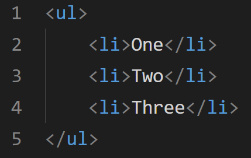
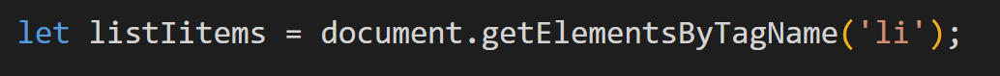
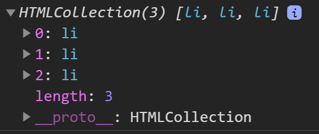

Why can't we use the parentNode method on an HTMLCollection directly?
You would have noticed in the previous lecture that our code looked like this:

`listItems_tags[0].parentNode.appendChild(document.createElement('li'));`

Lets understand why we have to access a node by using the [0] notation, rather than leaving this out.

###### Lets look at an example

Lets create a list:

Now lets put this entire list into an `HTMLCollection`, like this:

If we want to get to the `<ul>` tag, we can use `parentNode`.

We **can’t** do this:

But **we can** do this:

**The question is**, why do we have to access an actual `<li>` element (in our case the first li element using `[0]` notation)?

###### parentNode only works on nodes

Remember, the `parentNode` property is read only property which returns us the name of the parent node of the node its implemented on.

If we console our `listItems`, we get the following:

It’s an `HTMLCollection`, which is a collection of DOM nodes (as a reminder, while a `NodeList` can contain any node type, an `HTMLCollection` is supposed to only contain Element nodes).

Bottom line: an `HTMLCollection` is a COLLECTION of nodes. Its not a node itself.

And this is why you can’t use the `parentNode` method on the `HTMLCollection` itself … we have to access one of the elements inside it. We just so happened to use the first item in the collection using [0] notation, but we could have just as easily used [1] or [2] to get the same result.
